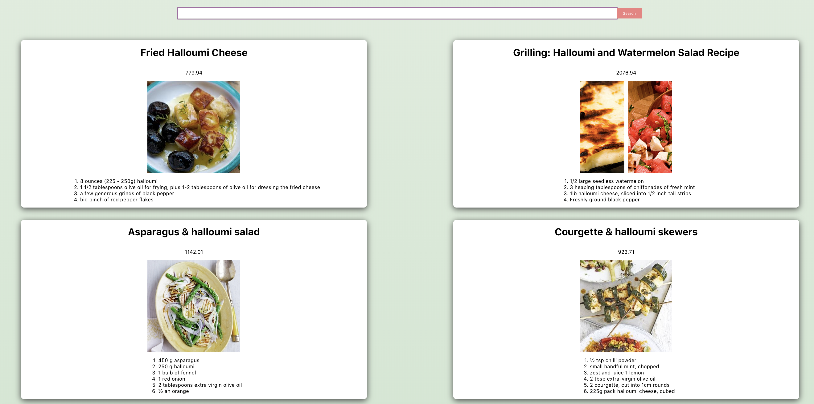

# Recipe App

Building a food recipe app with React using <a href="https://www.youtube.com/watch?v=U9T6YkEDkMo">this YouTube tutorial</a> and <a href="https://www.edamam.com">Edamam's Recipe Search API</a>.

# Running this app

1. CLone this repo
2. `cd` into this repo from the terminal
3. Type `npm` start
4. Visit `localhost:3000`

## Using this app

1. Follow steps 1 - 4 above
2. Type in ingredients into the search bar and press "Search".
3. A list of recipes together with a photo, calorie content and ingredients will be displayed that match your search.

## Screenshot

    

